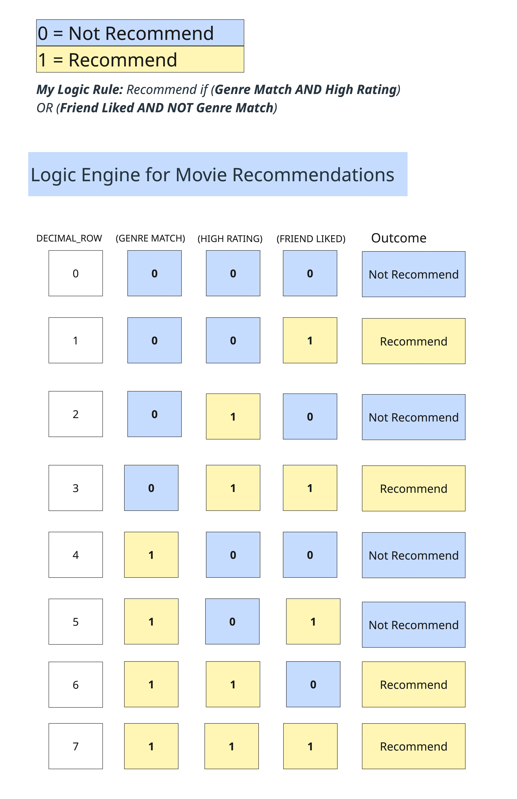

# 🧮 Boolean Logic Engine

> *A Boolean logic model that tests rule-based decision-making using truth tables which is the foundation for algorithmic thinking and sociological system modeling.*

---

## 🧠 Logic Rule
**Recommend if (Genre Match AND High Rating) OR (Friend Liked AND NOT Genre Match)**  

This rule models decision-making for movie recommendations, testing how multiple conditions (preferences, ratings, and peer influence) combine to create outcomes.

---

## 📊 Truth Table

This table evaluates all 8 combinations of True (1) and False (0) values across three binary conditions. It demonstrates how algorithms make decisions based on rule hierarchies, an early foundation for understanding AI systems and surveillance logic.

---

## 🔍 Analysis
This project reveals how small changes in logical structure alter decision outcomes, mirroring how platforms like **Netflix** or **YouTube** generate recommendations. Unexpected outcomes (Rows 1, 3, and 5) illustrate how certain data signals override others — a simplified form of **algorithmic bias**.

---

## 🎮 Game Connection
The rule structure resembles decision-making in **Blackjack (21)**:  
two distinct paths, one based on quality (safe strategy) and another on risk (bold play), both lead to the same successful outcome.

---

## 🧩 Research Context
This project represents the **first step in my algorithmic modeling work**, illustrating how rule-based systems simulate human decision-making. It directly informs my sociological research on **algorithmic governance, data systems, and surveillance**, showing how logic and power intertwine in digital decision architectures.
